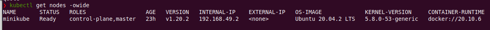

# k8s-guestbook

## Cosas

## Entregables

### Tarea 2.1

1. Se utilizó el siguiente comando para crear un cluster de 1 nodo

```
minikube start
```

- Una vez creado el cluster se ejecutó el comando ```kubectl cluster-info``` y se obtuvo lo siguiente:


- Se puede apreciar más información con el comando ```minikube status```:


- Tambien se ejecutó el comando ```kubectl get nodes -owide``` y se obtuvo el siguiente resultado:



### Tarea 2.2

1. Se utilizó el siguiente comando para crear un cluster multi-nodo

```
minikube start --nodes 3
```

- Una vez creado el cluster se ejecutó el comando ```kubectl cluster-info``` y se obtuvo lo siguiente:


- Se puede apreciar más información con el comando ```minikube status```:


- Tambien se ejecutó el comando ```kubectl get nodes -owide``` y se obtuvo el siguiente resultado:


### Tarea 2.3
Objetivo: Aplicación de reservas online.

Arquitectura: 


Funcionalidad: Agendar una reserva (write) y leer reservas (read).

Herramientas: Go, MongoDB.

### Tarea 2.5

